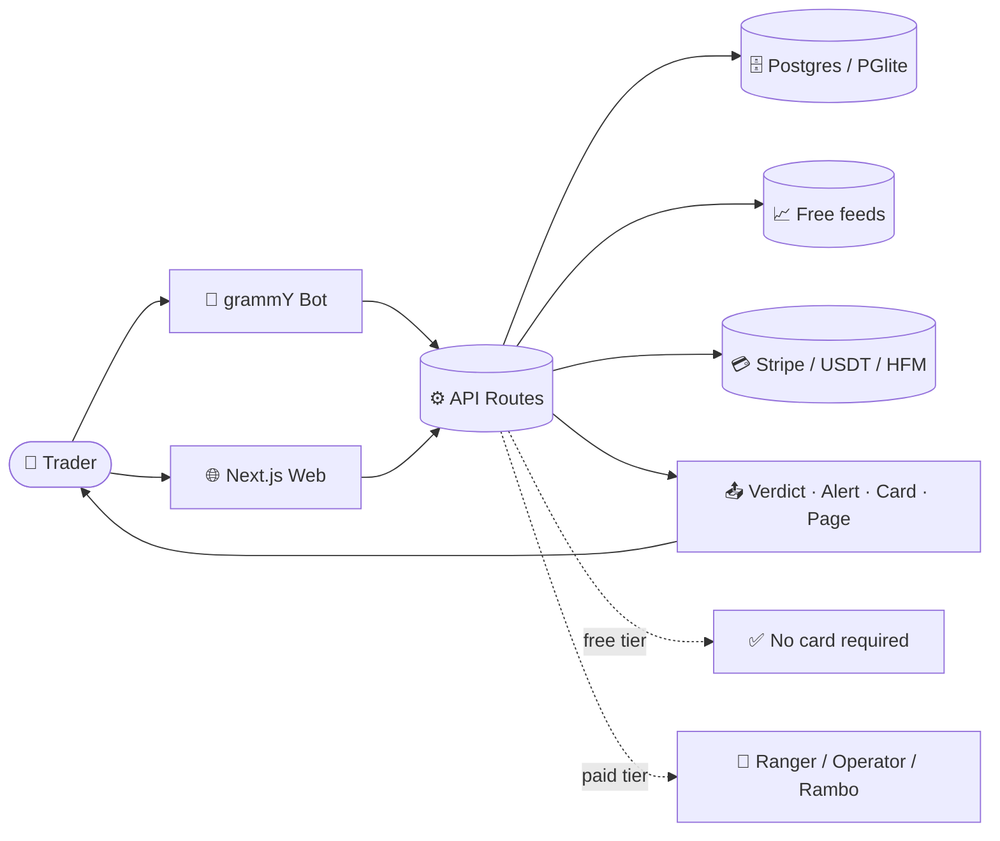
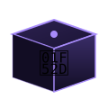
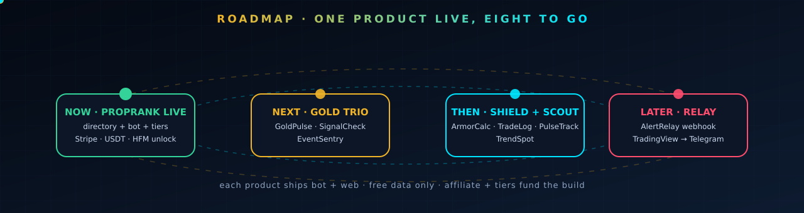
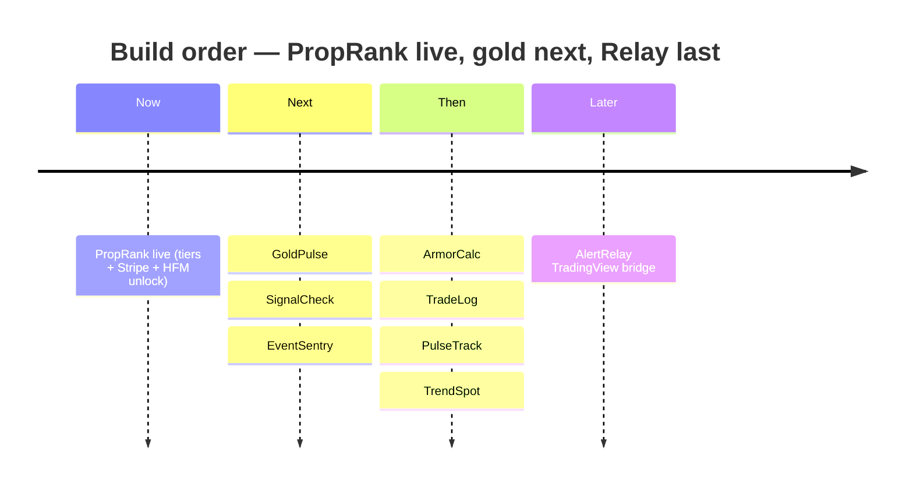

[](assets/badges-strip.svg)

[](#-the-4-brands--9-products) [](#-build-1--proprank-live) [](#-proprank-tiers--payments) [](#-quickstart) [](#-deploy-to-railway)

[](assets/stack-ticker.svg)

> [!IMPORTANT]
> **Educational research only. Not financial advice.** Every price, spread, and payout figure is indicative — verify with your broker before acting. Nothing here is a solicitation to trade, and no product guarantees a result.

[](assets/divider-flow.svg)

## ⚡ What This Is

EzyWeb builds **free trading tools** for traders burned by subscriptions, scams, and opaque markets — **4 soldier-themed brands, 9 products**, every one a Telegram bot plus a web dashboard, every one on free live data and free APIs.

> *“Build trust first. Monetize second.”*



[](assets/divider-flow.svg)

## 🪖 The 4 Brands & 9 Products



[](assets/icons/ic-aurum.svg)
**Brand 1 — AurumOps** · Gold / XAUUSD

| Product | Platform | What it does |
|---|---|---|
| **GoldPulse** | Telegram + web | Live gold price, alerts, sessions, DXY correlation, futures basis |
| **SignalCheck** | Telegram + web | Verify any gold signal vs real PAXG ticks → `REAL / IMPOSSIBLE` |
| **EventSentry** | Telegram + web | FOMC/CPI/NFP countdowns + gold volatility warnings |

[](assets/icons/ic-shield.svg)
**Brand 2 — ShieldOps** · Risk & Account Protection

| Product | Platform | What it does |
|---|---|---|
| **ArmorCalc** | Telegram + web | Position size, risk %, R-multiple calculator |
| **TradeLog** | Telegram + web | Trading journal with P&L analytics and export |
| **PulseTrack** | Telegram + web | Multi-exchange portfolio P&L + exposure summary |

[](assets/icons/ic-scout.svg)
**Brand 3 — ScoutOps** · Discovery

| Product | Platform | Status |
|---|---|---|
| **PropRank** ✅ | Telegram + web | **LIVE** — prop-firm directory, comparison, trust scores, tiers |
| **TrendSpot** | Telegram + web | Trending stocks/crypto/forex screener |

[](assets/icons/ic-relay.svg)
**Brand 4 — RelayOps** · Signal Infrastructure

| Product | Platform | What it does |
|---|---|---|
| **AlertRelay** | Telegram + web | TradingView webhook → Telegram bridge |

[](assets/divider-flow.svg)

## 🥇 Build #1 — PropRank (LIVE)

Prop-firm directory + comparison engine + grammY Telegram bot, on one shared Postgres backend. Browse free as **🥾 Scout**; pay only for research scale.

**Telegram bot commands:**

- `/start` — welcome + command list
- `/top` — top ranked prop firms
- `/firm NAME` — detailed firm card with affiliate CTA
- `/search TEXT` — search firms (Ranger+)
- `/compare A vs B` — side-by-side comparison (Ranger+)

**Web routes:** `/` home · `/scoutops/proprank` directory · `/scoutops/proprank/<slug>` detail · `/pricing` tiers · `/hfm-unlock` Rambo-for-life · `/account` · `/api/propfirms` JSON · `/api/telegram/webhook` bot ingress

### 🎯 PropRank Tiers & Payments

Single source of truth: [`lib/tiers.ts`](lib/tiers.ts) (features) + [`lib/stripe.ts`](lib/stripe.ts) (checkout).

| Tier | Monthly | Yearly | Unlock |
|---|---|---|---|
| 🥾 **Scout** | Free forever | — | Browse the basics (3 firm details/day) |
| 🎯 **Ranger** | $7 | $60 · Save 29% | Search + compare 2 at a time |
| 🛡️ **Operator** | $15 | $140 · Save 22% | Advanced filters, CSV export, compare 5 |
| 🔥 **Rambo** | $29 | $260 · Save 25% | Trust-score breakdown, API key, unlimited compare — **or free for life via HFM IB** |

| Method | How it works |
|---|---|
| 💳 **Stripe** | Monthly/yearly Price per tier (`STRIPE_PRICE_*`); missing IDs fall back gracefully — the pricing page tells you instead of erroring |
| ₮ **USDT (TRC-20)** | Manual wallet shown on the unlock page (`NEXT_PUBLIC_USDT_WALLET`), admin-confirmed |
| 🤝 **HFM IB** | Open + fund an HFM account under the IB link (MY/ID) → **Rambo free forever** (`/hfm-unlock`) |

[](assets/divider-flow.svg)

## 📊 Platforms

Delivery is chosen by shape, never by taste:

| Shape of the job | Platform | Why |
|---|---|---|
| Ad-hoc trigger, or an alert that must arrive | 🤖 **Telegram (grammY)** | Zero install, mobile-native, webhook-driven |
| Directory, form, table, checkout page | 🌐 **Next.js 15 Web** | Filters and tiers a chat window would fight |
| Heavy view *and* time-critical push | 🤖🌐 **Both** | Web renders it, the bot warns you |

✅ **Free tier on every product.** Nothing is paywalled at the door — paid tiers sell only *research scale* (more compares, filters, exports, API).

[](assets/divider-flow.svg)

## 🗺️ Roadmap

[](assets/roadmap-orbit.svg)



### ✅ 9-Product Build Checklist

> Rules: Telegram bot + website · free data/APIs · free tier on everything.

- [x] **PropRank** — directory + comparison + bot ✅ **BUILT**
- [ ] **GoldPulse** — live XAUUSD price, alerts, sessions, DXY correlation
- [ ] **SignalCheck** — verify gold signals vs real ticks
- [ ] **EventSentry** — FOMC/CPI/NFP countdowns + volatility warnings
- [ ] **ArmorCalc** — position size & risk calculator
- [ ] **TradeLog** — trading journal + P&L analytics
- [ ] **PulseTrack** — multi-exchange portfolio tracker
- [ ] **TrendSpot** — trending assets screener
- [ ] **AlertRelay** — TradingView → Telegram webhook bridge

### 🚀 Launch gate (per product)

- [x] Runs on free tier
- [x] Affiliate link wired via env
- [ ] Telegram Stars / tips wired
- [x] Web dashboard live
- [ ] Cross-links to other live products
- [x] Not-financial-advice disclaimer
- [ ] Deployed + smoke-tested live

[](assets/divider-flow.svg)

## 🚀 Quickstart

Node.js 22 + PowerShell. Each command goes into **PowerShell** (search "PowerShell" on Windows).

```powershell
cd C:\Users\%USERNAME%\Documents
git clone https://github.com/printezy247/ezyweb.git
cd ezyweb
npm install
copy .env.example .env.local
mkdir tmp
$env:DATABASE_URL="pglite://./tmp/ezyweb.db"
npm run db:setup        # Migrations completed. Seeded 5 prop firms.
npm run dev
```

Open http://localhost:3000 (home) and http://localhost:3000/scoutops/proprank (directory). `Ctrl + C` stops the server.

**Telegram bot locally** — webhooks need a public URL, so use [ngrok](https://ngrok.com/download):

```powershell
ngrok http 3000
curl "https://api.telegram.org/botYOUR_BOT_TOKEN/setWebhook" `
  -d url="https://abc123.ngrok.io/api/telegram/webhook" `
  -d secret_token="my-secret-token-123"
```

Then message your bot: `/start` · `/top` · `/firm ftmo` · `/compare ftmo vs fundednext`.

| Variable | Required | Purpose |
|---|---|---|
| `DATABASE_URL` | ✅ | Railway Postgres URL (or `pglite://./tmp/ezyweb.db` locally) |
| `NEXT_PUBLIC_SITE_URL` | ✅ | Public site URL (webhook + links) |
| `TELEGRAM_BOT_TOKEN` | ✅ | From @BotFather |
| `TELEGRAM_WEBHOOK_SECRET` | ✅ | Any random string, webhook security |
| `PROPRANK_AFFILIATE_URL` / `_LABEL` | 💰 | Prop-firm referral link + button label |
| `HFM_MALAYSIA_URL` / `HFM_INDONESIA_URL` | 💰 | Rambo-for-life IB links (refid 30548341) |
| `STRIPE_SECRET_KEY` / `STRIPE_WEBHOOK_SECRET` | 💳 | Card checkout (`sk_…` / `whsec_…`) |
| `STRIPE_PRICE_*` (6) | 💳 | Per-tier monthly/yearly Prices (`price_…`) |
| `NEXT_PUBLIC_USDT_WALLET` | 💳 | Manual USDT address on the unlock page |
| `ADMIN_TELEGRAM_IDS` | ✅ | Comma-separated admin chat IDs |

`.env.local` is gitignored — never commit real credentials. Full deploy notes: [`DEPLOY.md`](DEPLOY.md).

[](assets/divider-flow.svg)

## ☁️ Deploy to Railway

1. https://railway.app → sign in with GitHub → **New Project → Deploy from GitHub repo** → `printezy247/ezyweb`.
2. **+ New → Database → PostgreSQL**.
3. Variables tab: `DATABASE_URL` via **Add Reference** to Postgres, plus the table above.
4. **Deploy** (builds `Dockerfile` automatically, `ON_FAILURE` retries ×10).
5. Set `NEXT_PUBLIC_SITE_URL` to the public URL → redeploy → point Telegram at it:

```powershell
curl "https://api.telegram.org/botYOUR_BOT_TOKEN/setWebhook" `
  -d url="https://ezyweb-production.up.railway.app/api/telegram/webhook" `
  -d secret_token="YOUR_TELEGRAM_WEBHOOK_SECRET"
```

Done — PropRank is live. CI-friendly checks: `npm run typecheck`, `npm run lint`, `npm run build`.

[](assets/divider-flow.svg)

## 🧱 Repo Map

```
ezyweb/
├── assets/                   # animated hero, badges, nav chips, ticker,
│                             # 3D metrics, roadmap orbit, brand icons (this page's art)
├── app/                      # Next.js 15 App Router
│   ├── page.tsx              # home
│   ├── scoutops/proprank/    # directory + [slug] detail
│   ├── pricing/              # tiers + Stripe/USDT/HFM checkout
│   ├── hfm-unlock/           # Rambo-for-life IB flow
│   ├── account/              # subscription status
│   └── api/                  # propfirms · checkout · stripe/config+webhook · telegram/webhook
├── lib/                      # tiers.ts (pricing truth) · stripe.ts · users.ts
├── db/                       # Drizzle schema + Postgres/PGlite + seed (5 firms)
├── drizzle/                  # generated SQL migrations
├── archive/                  # legacy Python code
├── Dockerfile + railway.json # Railway deploy
└── DEPLOY.md                 # full hosting guide
```

[](assets/divider-flow.svg)


### printezy · ezyweb

Next.js 15 · React 19 · grammY · Drizzle ORM · Postgres · Stripe · Railway

**Educational research only. Not financial advice.** Verify every price with your broker.

MIT
